# Ahorcado_game
#### Descripción
Construir una aplicación que emule un ahorcado utilizando Python.

Condiciones:

-Código original
-Uso de herramientas vistas en el curso
-Interacción y manejo a través de la consola
-Base de datos de al menos 1000 palabras
-Dibujo de hangman en integraz gráfica
-Definidido por el usuario:
-Ingreso de las letras
-Nivel de dificultad: Asociado a la cantidad de intentos para dibujar el ahorcado, cantidad de caracteres de la palabra.
-Foco: Función core del juego, a partir de las letras validar existencia en la palabra e ir actualziando interfaz.

Features extra:

Cuenta regresiva
Manejo de puntajes
Soporte para otros idiomas (inglés, francés, aleman)
Manejo de jugadores (2 juegos simultaneos)

#### Puntos importantes
-Se debe elaborar un repo donde presente la solución al problema planteado. El repo debe contener la explicación de la solución, cómo se abordo el problema, diagramas. Y una sección de como instalar y usar el desarrollo.
-El repo debe tener como colaboradores a todos los miembros del equipo, de forma que se evidencie que trabajaron de forma colectiva.
-Los códigos elaborados deben estar apropiadamente comentados.
-Todos los programas deben incorporar el uso de funciones
-El repo debe estar muy bien hecho, ya que esa es la manera de presentar.
#### Valor del avance
Avance (10%)
Definición de alternativa - Diagramas preliminares - Solución preliminar -> Exposición oral, 10 minutos.
Criterios evaluación avance: claridad de la exposición (20%), calidad de entregables (40%), temas del curso adecuadamente empleados (40%).

---
<div align=center>
  
</div>  <br>

# **PROYECTO FINAL PROGRAMACIÓN DE COMPUTADORES**

 **NOMBRE DEL EQUIPO:** Wizards of cOdeZ.

<p align="center">
  
</p>


 **INTEGRANTES:**
 - Parra Osorio Maria Fernanda
 - Ramirez  Rodriguez Nicolás
 - Monroy Gómez Nicolás Alejandro

En este repositorio abarcaremos la alternativa número 2: El ahorcado. 

**1. Objetivo del proyecto:**

Desarrollar la alternativa escogida en python, usando y aplicando los conocimientos adquiridos durante el semestre por medio de las clases y los retos.

**2. Solución planteada:**

Para realizar el ahorcado hemos decidido usar diversas funciones relacionadas a la selección de palabras, las cuales estarán almacenadas en una lista y se escogerá cualquiera de ellas para iniciar el juego. De igual manera una con la que, dependiendo de la posición de cada letra de la palabra que fue ingresada en la consola, sera un acierto y se podrá continuar con la siguiente letra, actualizando la palabra escogida; o se empezara a dibujar el ahorcado por medio de prints, reduciendo el número de oportunidades y actualizando el dibujo del ahorcado en cada intento erróneo hasta que el dibujo se complete.

**3. Como abordamos el problema:**

Primero e hizo un analisis del juego en cuestion para entender su funcionamiento y que herramientas podriamos usar para realizarlo, también se consultaron videos, paginas y documentos en donde se realizo una lluvia de ideas la cual se utilizo para realizar el diagrama de flujo comprendiendo a profundidad el juego y su estructura lógica.

A partir del diagrama, iniciamos la construcción del banco de palabras el cual consiste de 1000 palabras el cual se elijirá aleatoriamente para tener una base que podamos probar mas adelante el codigo. Luego de esto, iniciamos creando las funciones del codigo del programa del ahorcado, apoyandonos en diversos materiales que encontramos en internet para comprender ciertos errores que pudieramos tener al momento de desarrollar nuestro codigo.


**4. Diagrama de la funcionalidad general del programa:**

``` mermaid

flowchart TD
%% Nodes
A(" Inicio"):::green
B1("Generar una palabra"):::orange
B("intentos_fallidos = 0 "):::orange
C("Evaluar la longitud de la palabra"):::blue
D("Imprimir la longitud de la palabra
n = leng..."):::blue
E("Convertir la palabra a incognita
(Reemplazar las letras por guiones)"):::yellow
F("Ingresar una palabra"):::pink
G{"leng (palabra ingresada) == leng (palabra generada)?"}:::purple
H("Dividir la palabra generada"):::green
I("No corresponde a la cantidad de letras"):::orange
J("cada letra = objeto de una lista"):::orange
K("Divide la palabra ingresada"):::orange
L("cada letra = objeto de una lista"):::orange
M("Recorrer cada letra de palabra ingresada en la lista de la palabra generada"):::orange
N{"La letra corresponde a un objeto en lista de la palabra generada?"}:::purple
O("Imprime la letra en la posicion que va"):::orange
P("No imprime la letra "):::orange
Q{"Es la ultima letra de la palabra ingresada?"}:::orange
R(" Acaba con el recorrido"):::orange
S("Sigue con la siguiente letra de la palabara ingresada "):::orange
T{"Palabra ingresada == palabra generada?"}:::purple
U("has ganado"):::orange
V("intentos_fallidos += 1 "):::orange
W{"intentos_fallidos == 1 "}:::orange
X{"intentos fallidos == 2 "}:::orange
Y("imprimir la base del ahorcado "):::orange
Z{"intentos fallidos == 3 "}:::orange
A1("imprimir la base del ahorcado + la soga y la cabeza "):::orange
C1{"intentos fallidos == 4"}:::orange
D1("agrega el torso y el brazo izquierdo"):::orange
E1{"intentos fallidos == 5"}:::orange
F1("agrega el brazo derecho"):::orange
G1{"intentos fallidos == 6"}:::orange
H1("agrega la pierna izquierda"):::orange
I1("agrega la pierna derecha"):::orange
J1("Perdiste, la palabra a adivinar era -palabra_generada-"):::orange
K1("Fin"):::green
L1("Fin"):::green

%% Edges
A --> B --> B1 --> C --> D
D --> E --> F --> G
G -- Yes --> H
G -- No --> I --> F
H --> J --> K --> L 
L --> M --> N
N -- Yes --> O
N -- No --> P
O --> Q
P --> Q
Q -- Yes --> R
Q -- No --> S --> N
R --> T 
T -- Yes --> U --> L1
T -- No --> V --> W
W -- Sino --> X
W -- Yes --> Y --> F
X -- Sino --> Z
X -- Yes --> A1 --> F
Z -- Sino --> C1
Z -- Yes --> D1 --> F
C1 -- Sino --> E1
C1 -- Yes --> F1 --> F
E1 -- Sino --> G1
E1 -- Yes --> H1 --> F
G1 --> I1 --> J1 --> K1

%% Styling
classDef green fill:#B2DFDB,stroke:#00897B,stroke-width:2px;
classDef orange fill:#FFE0B2,stroke:#FB8C00,stroke-width:2px;
classDef blue fill:#BBDEFB,stroke:#1976D2,stroke-width:2px;
classDef yellow fill:#FFF9C4,stroke:#FBC02D,stroke-width:2px;
classDef pink fill:#F8BBD0,stroke:#C2185B,stroke-width:2px;
classDef purple fill:#E1BEE7,stroke:#8E24AA,stroke-width:2px;

```



**5. Desarrollo del codigo y notebook:**<br>
**5.1. Banco de palabras.**
Para esta parte inicial se construyó un archivo de texto con una lista de más de 1000 palabras, para posteriormente crear un código en el que por medio de las carpetas se pueda abrir el archivo en forma de texto y suprimiendo los espacios para generar una lista aleatoria en donde se elija una de ellas por medio de una ruta en el directorio.<br>
``` python
import random #Importar el modulo que permite elegir aleatoriamente

def leer_banco_palabras(): #Se define la función principal
    palabras = []
    archivo = open('palabras.txt', 'r', encoding='utf-8') # Abre el archivo, 'r' para tener modo lectura y 'utf-8' una codificación evitando que quede mal escritas las palabras con caracteres especiales
    for linea in archivo:
        palabras.append(linea.strip())  #Elimina espacios y saltos de línea 
    archivo.close() #Cerramos el archivo
    return palabras
```
- En caso de que el código anterior genere un error utilizar el siguiente código: <br>

``` python
import random #Importar el modulo que permite elegir aleatoriamente

def obtener_palabra_aleatoria(palabras): #Se define la función principal
    archivo = open(palabras, 'r', encoding='utf-8') # 'r' para tener modo lectura y 'utf-8' una codificación evitando que quede mal escritas las palabras con caracteres especiales
    palabras = [palabra.strip() for palabra in archivo.readlines()] #Elimina espacios y saltos de línea y crea una lista con palabras limpias
    archivo.close() #Cerramos el archivo
    return random.choice(palabras)

ruta = "C:/Users/pmafe/Documents/UNAL/programación/pdc/palabras.txt"  
palabra = obtener_palabra_aleatoria(ruta)
print("Palabra aleatoria:", palabra) #Imprimimos de manera aleatoria la palabra seleccionada
```

**5.2. Código del juego.**
- Dibujo del hangman:
  ``` python
  def dibujar_ahorcado(intentos): # Se define esta función para generar el dibujo según el número de intentos
    if intentos == 0:
        print("  +---+")
        print("  |   |")
        print("      |")
        print("      |")
        print("      |")
        print("      |")
        print("=========")
    elif intentos == 1:
        print("  +---+")
        print("  |   |")
        print("  O   |")
        print("      |")
        print("      |")
        print("      |")
        print("=========")
    elif intentos == 2:
        print("  +---+")
        print("  |   |")
        print("  O   |")
        print("  |   |")
        print("      |")
        print("      |")
        print("=========")
    elif intentos == 3:
        print("  +---+")
        print("  |   |")
        print("  O   |")
        print(" /|   |")
        print("      |")
        print("      |")
        print("=========")
    elif intentos == 4:
        print("  +---+")
        print("  |   |")
        print("  O   |")
        print(" /|\\  |")
        print("      |")
        print("      |")
        print("=========")
    elif intentos == 5:
        print("  +---+")
        print("  |   |")
        print("  O   |")
        print(" /|\\  |")
        print(" /    |")
        print("      |")
        print("=========")
    elif intentos == 6:
        print("  +---+")
        print("  |   |")
        print("  O   |")
        print(" /|\\  |")
        print(" / \\  |")
        print("      |")
        print("=========")
     ```

- Funciones
  Se definieron las funciones con respecto a las palabras, letras, variables; en la cual nos genera el juego del ahorcado.
``` pyhton
    def generar_palabra_aleatoria(palabras):
  # Se define esta funcion para seleccionar una palabra en el rango de la lista.
    indice = random.randint(0, len(palabras) - 1)
    return palabras[indice] #retorna una palabra aleatoria que este dentro de la lista

def evaluar_palabra(palabra_generada, palabra_ingresada, letras_descubiertas):
    resultado = list(letras_descubiertas) 
    # Se crean listas de posiciones disponibles para cada letra en la palabra ingresada
    letras_disponibles = {}
    for i in range(len(palabra_ingresada)): #Aqui se recorre la cantidad de letras de la palabra
        letra = palabra_ingresada[i]
        if letra not in letras_disponibles: #si la letra no corresponde no se agrega o imprime vacio
            letras_disponibles[letra] = []
        letras_disponibles[letra].append(i) #si corresponde entonces se agrega al final de la lista

    # Primero: encontrar coincidencias exactas
    for i in range(len(palabra_generada)):
        if palabra_generada[i] == palabra_ingresada[i]: #evalua si la letra coincide en la misma posicion
            resultado[i] = palabra_generada[i]
            # Remover esta posición de las letras disponibles si existe
            if palabra_ingresada[i] in letras_disponibles and i in letras_disponibles[palabra_ingresada[i]]: 
                letras_disponibles[palabra_ingresada[i]].remove(i) #Se remueve si no coinciden

    # Segundo: encontrar letras en posiciones diferentes
    for i in range(len(palabra_generada)):
        if resultado[i] == '*':  # Si aún no hemos encontrado esta letra
            letra_buscada = palabra_generada[i]
            if letra_buscada in letras_disponibles and letras_disponibles[letra_buscada]: #Condicion para buscar la letra en una posicion distinta de la palabra generada o si se repite en diferentes posiciones
                # Hay una posición disponible para esta letra
                pos = letras_disponibles[letra_buscada][0]
                resultado[i] = letra_buscada
                letras_disponibles[letra_buscada].pop(0)

    return ''.join(resultado)

def mostrar_estado_juego(intentos, intentos_maximos, palabra_longitud, letras_descubiertas=None):
    print("JUEGO DEL AHORCADO")
    print("==================")
    dibujar_ahorcado(intentos)
    print("La palabra tiene "+ str(palabra_longitud) +" letras")
    if letras_descubiertas:
        print("Progreso actual: "+ str (letras_descubiertas))
    print("Intentos restantes: " + str(intentos_maximos - intentos))
    print("==================")

def combinar_progreso(progreso_anterior, nuevo_progreso): #funcion para conocer el progreso, evalua el progeso anterior con el nuevo, entonces genera un progreso actual
    resultado = ''
    for i in range(len(progreso_anterior)):
        if nuevo_progreso[i] != '*':
            resultado += nuevo_progreso[i]
        else:
            resultado += progreso_anterior[i]
    return resultado

def jugar_ahorcado():
  #se llaman las funciones anteriores como variables
    palabras = leer_banco_palabras()
    palabra_misteriosa = generar_palabra_aleatoria(palabras).lower().strip()
    intentos_maximos = 6
    intentos_realizados = 0
    letras_descubiertas = '*' * len(palabra_misteriosa)

    print("¡Bienvenido al Juego del Ahorcado!")
    print("La palabra tiene ",(len(palabra_misteriosa)), "letras")
    

    #Actualizacion y control del estado de juego
    while intentos_realizados < intentos_maximos:
        mostrar_estado_juego(intentos_realizados, intentos_maximos,
                           len(palabra_misteriosa), letras_descubiertas)

        palabra_usuario = input("Ingresa una palabra: ").lower().strip()

        if len(palabra_usuario) != len(palabra_misteriosa):
            print("Error: La palabra debe tener ",(len(palabra_misteriosa)), " letras.")
            continue

        # Guardamos el estado actual antes de evaluar
        progreso_anterior = letras_descubiertas

        # Evaluamos el nuevo intento
        nuevo_progreso = evaluar_palabra(palabra_misteriosa, palabra_usuario, letras_descubiertas)

        # Combinamos el progreso anterior con el nuevo usando la nueva función
        letras_descubiertas = combinar_progreso(progreso_anterior, nuevo_progreso)

        intentos_realizados += 1
        print("Intento", (intentos_realizados),":", (palabra_usuario))

        if letras_descubiertas == palabra_misteriosa:
            mostrar_estado_juego(intentos_realizados, intentos_maximos,
                               len(palabra_misteriosa), letras_descubiertas)
            print("\n¡Felicitaciones! ¡Has ganado!")
            print("En efecto, la palabra era: ",(palabra_misteriosa))
            return

        if intentos_realizados == intentos_maximos:
            mostrar_estado_juego(intentos_realizados, intentos_maximos,
                               len(palabra_misteriosa), letras_descubiertas)
            print("¡Game Over! Te has quedado sin intentos")
            print("La palabra era: ",(palabra_misteriosa))
            return

if __name__ == "__main__":
    jugar_ahorcado()
  ```
  # **Final_code** <br>
  Este codigo consiste en la unión de todos los elementos ya utilizados anteriormente, agregando niveles de dificultad, otros idiomas y la interfaz gráfica. Además el codigo mantiene la cantidad de intentos dependiendo de las partes del hangman.<br>
  
  ```pyhton
import tkinter as tk
from tkinter import messagebox
import random

class AhorcadoGUI:
    def __init__(self, root):
        # Configuración básica de la ventana principal
        self.root = root
        self.root.title("Juego del Ahorcado")  # Título de la ventana
        self.root.geometry("800x600")          # Tamaño de la ventana
        self.root.resizable(False, False)      # Ventana no redimensionable
        self.root.configure(bg="#f0f0f0")      # Color de fondo
        
        # Variables que controlan el estado del juego
        self.dificultad_elegida = "facil"      # Dificultad predeterminada
        self.idioma_elegido = "español"        # Idioma predeterminado
        self.palabra_misteriosa = ""           # Palabra a adivinar
        self.letras_descubiertas = ""          # Progreso del jugador
        self.intentos_realizados = 0           # Contador de intentos
        self.intentos_maximos = 10             # Número máximo de intentos permitidos
        self.en_juego = False                  # Indica si hay un juego en curso
        
        # Variable para el sistema de puntuación
        self.puntaje_acumulado = 0             # Contador de puntaje acumulado
        
        # Inicializa los frames y el menú principal
        self.crear_frames()
        self.mostrar_menu_principal()
        
    def crear_frames(self):
        # Frame principal que contiene todos los demás elementos
        self.frame_principal = tk.Frame(self.root, bg="#f0f0f0")
        self.frame_principal.pack(fill=tk.BOTH, expand=True, padx=20, pady=20)
    
        # Frames para las distintas secciones de la aplicación
        self.frame_menu = tk.Frame(self.frame_principal, bg="#f0f0f0")  # Para el menú principal
        self.frame_juego = tk.Frame(self.frame_principal, bg="#f0f0f0") # Para la pantalla de juego
        self.frame_dificultad = tk.Frame(self.frame_principal, bg="#f0f0f0") # Para selección de dificultad
        self.frame_idioma = tk.Frame(self.frame_principal, bg="#f0f0f0") # Para selección de idioma
        
    def mostrar_menu_principal(self):
        # Limpia frames anteriores
        self.limpiar_frames()
    
        # Evita duplicación de widgets
        for widget in self.frame_menu.winfo_children():
            widget.destroy()
        
        # Muestra el frame del menú
        self.frame_menu.pack(fill=tk.BOTH, expand=True)
    
        # Título del juego
        titulo = tk.Label(self.frame_menu, text="¡Bienvenido al juego del ahorcado!", 
                    font=("Helvetica", 24, "bold"), bg="#f0f0f0")
        titulo.pack(pady=20)
        
        # Mostrar puntaje acumulado
        puntaje_label = tk.Label(self.frame_menu, 
                          text=f"Puntaje acumulado: {self.puntaje_acumulado}", 
                          font=("Helvetica", 16, "bold"), 
                          fg="#007711", 
                          bg="#f0f0f0")
        puntaje_label.pack(pady=10)
    
        # Configuración común para todos los botones
        estilo_boton = {"font": ("Helvetica", 14), "width": 30, "height": 2}
    
        # Botones del menú con sus respectivas funciones
        btn_dificultad = tk.Button(self.frame_menu, text="Seleccionar dificultad", 
                              command=self.mostrar_dificultad, **estilo_boton)
        btn_dificultad.pack(pady=10)
    
        btn_idioma = tk.Button(self.frame_menu, text="Seleccionar idioma", 
                          command=self.mostrar_idioma, **estilo_boton)
        btn_idioma.pack(pady=10)
    
        btn_jugar = tk.Button(self.frame_menu, text="Iniciar juego", 
                         command=self.iniciar_juego, **estilo_boton)
        btn_jugar.pack(pady=10)
    
        btn_salir = tk.Button(self.frame_menu, text="Salir", 
                         command=self.salir_juego, **estilo_boton)
        btn_salir.pack(pady=10)

    def salir_juego(self):
        # Reinicia el puntaje acumulado a 0 cuando el usuario sale
        self.puntaje_acumulado = 0
        self.root.quit()

    def mostrar_dificultad(self):
        # Limpia frames anteriores y evita duplicación
        self.limpiar_frames()
        for widget in self.frame_dificultad.winfo_children():
            widget.destroy()
    
        # Muestra el frame de selección de dificultad
        self.frame_dificultad.pack(fill=tk.BOTH, expand=True)
    
        # Título de la sección
        titulo = tk.Label(self.frame_dificultad, text="Selecciona la dificultad", 
                    font=("Helvetica", 24, "bold"), bg="#f0f0f0")
        titulo.pack(pady=20)
    
        # Configuración común para los botones
        estilo_boton = {"font": ("Helvetica", 14), "width": 30, "height": 2}
    
        # Botones para cada nivel de dificultad
        btn_facil = tk.Button(self.frame_dificultad, text="Fácil", 
                         command=lambda: self.establecer_dificultad("facil"), **estilo_boton)
        btn_facil.pack(pady=10)
    
        btn_media = tk.Button(self.frame_dificultad, text="Media", 
                         command=lambda: self.establecer_dificultad("media"), **estilo_boton)
        btn_media.pack(pady=10)
    
        btn_dificil = tk.Button(self.frame_dificultad, text="Difícil", 
                           command=lambda: self.establecer_dificultad("dificil"), **estilo_boton)
        btn_dificil.pack(pady=10)
    
        # Botón para volver al menú principal
        btn_volver = tk.Button(self.frame_dificultad, text="Volver al menú", 
                          command=self.mostrar_menu_principal, **estilo_boton)
        btn_volver.pack(pady=20)

    def mostrar_idioma(self):
        # Similar a la función de dificultad, pero para idiomas
        self.limpiar_frames()
        for widget in self.frame_idioma.winfo_children():
            widget.destroy()
        
        self.frame_idioma.pack(fill=tk.BOTH, expand=True)
    
        titulo = tk.Label(self.frame_idioma, text="Selecciona el idioma", 
                    font=("Helvetica", 24, "bold"), bg="#f0f0f0")
        titulo.pack(pady=20)
    
        estilo_boton = {"font": ("Helvetica", 14), "width": 30, "height": 2}
    
        # Botones para cada idioma disponible
        btn_español = tk.Button(self.frame_idioma, text="Español", 
                           command=lambda: self.establecer_idioma("español"), **estilo_boton)
        btn_español.pack(pady=10)
    
        btn_ingles = tk.Button(self.frame_idioma, text="Inglés", 
                          command=lambda: self.establecer_idioma("ingles"), **estilo_boton)
        btn_ingles.pack(pady=10)
    
        btn_volver = tk.Button(self.frame_idioma, text="Volver al menú", 
                          command=self.mostrar_menu_principal, **estilo_boton)
        btn_volver.pack(pady=20)

    def establecer_dificultad(self, dificultad):
        # Guarda la dificultad seleccionada
        self.dificultad_elegida = dificultad
        # Muestra mensaje de confirmación
        messagebox.showinfo("Dificultad", f"Has seleccionado la dificultad: {dificultad}")
        # Vuelve al menú principal
        self.mostrar_menu_principal()

    def establecer_idioma(self, idioma):
        # Guarda el idioma seleccionado
        self.idioma_elegido = idioma
        # Muestra mensaje de confirmación
        messagebox.showinfo("Idioma", f"Has seleccionado el idioma: {idioma}")
        # Vuelve al menú principal
        self.mostrar_menu_principal()

    def limpiar_frames(self):
        # Oculta todos los frames para evitar superposición
        self.frame_menu.pack_forget()
        self.frame_juego.pack_forget()
        self.frame_dificultad.pack_forget()
        self.frame_idioma.pack_forget()

    def iniciar_juego(self):
        # Limpia la interfaz
        self.limpiar_frames()
        for widget in self.frame_juego.winfo_children():
            widget.destroy()
        
        # Muestra el frame de juego
        self.frame_juego.pack(fill=tk.BOTH, expand=True)
    
        # Inicializa las variables del juego
        self.palabra_misteriosa = self.seleccion_palabra().lower().strip()  # Selecciona palabra aleatoria
        self.letras_descubiertas = '*' * len(self.palabra_misteriosa)  # Inicializa con asteriscos
        self.intentos_realizados = 0  # Reinicia contador de intentos
        self.en_juego = True  # Establece estado de juego activo
    
        # Crea la interfaz de juego
        self.crear_interfaz_juego()
        self.actualizar_interfaz_juego()

    def crear_interfaz_juego(self):
        # Limpia el frame de juego
        for widget in self.frame_juego.winfo_children():
            widget.destroy()
    
        # Sección superior con información del juego
        frame_info = tk.Frame(self.frame_juego, bg="#f0f0f0")
        frame_info.pack(fill=tk.X, pady=10)
    
        # Título del juego
        self.lbl_titulo = tk.Label(frame_info, text="JUEGO DEL AHORCADO", 
                             font=("Helvetica", 20, "bold"), bg="#f0f0f0")
        self.lbl_titulo.pack(pady=5)
    
        # Muestra la configuración actual (dificultad e idioma)
        config_frame = tk.Frame(frame_info, bg="#f0f0f0")
        config_frame.pack(pady=5)
    
        tk.Label(config_frame, text=f"Dificultad: {self.dificultad_elegida}", 
           font=("Helvetica", 12), bg="#f0f0f0").pack(side=tk.LEFT, padx=10)
        tk.Label(config_frame, text=f"Idioma: {self.idioma_elegido}", 
           font=("Helvetica", 12), bg="#f0f0f0").pack(side=tk.LEFT, padx=10)
        
        # Muestra el puntaje acumulado en la interfaz de juego
        tk.Label(config_frame, text=f"Puntaje: {self.puntaje_acumulado}", 
           font=("Helvetica", 12, "bold"), fg="#007711", bg="#f0f0f0").pack(side=tk.LEFT, padx=10)
    
        # Muestra longitud de la palabra
        self.lbl_palabra_longitud = tk.Label(frame_info, 
                                      text=f"La palabra tiene {len(self.palabra_misteriosa)} letras", 
                                      font=("Helvetica", 14), bg="#f0f0f0")
        self.lbl_palabra_longitud.pack(pady=5)
    
        # Frame para el dibujo del ahorcado y la información del juego
        frame_dibujo = tk.Frame(self.frame_juego, bg="white", bd=2, relief=tk.RIDGE)
        frame_dibujo.pack(fill=tk.BOTH, expand=True, padx=20, pady=10)
    
        # Canvas para dibujar el ahorcado
        self.canvas = tk.Canvas(frame_dibujo, width=300, height=300, bg="white")
        self.canvas.pack(side=tk.LEFT, padx=20, pady=20)
    
        # Panel lateral para información de intentos y progreso
        panel_info = tk.Frame(frame_dibujo, bg="white")
        panel_info.pack(side=tk.RIGHT, fill=tk.BOTH, expand=True, padx=20, pady=20)
    
        # Muestra las letras descubiertas hasta el momento
        frame_letras = tk.Frame(panel_info, bg="white")
        frame_letras.pack(fill=tk.X, pady=10)
    
        tk.Label(frame_letras, text="Progreso actual:", 
           font=("Helvetica", 14), bg="white").pack(side=tk.LEFT, padx=5)
    
        self.lbl_letras = tk.Label(frame_letras, text=self.letras_descubiertas, 
                             font=("Courier", 18, "bold"), bg="white")
        self.lbl_letras.pack(side=tk.LEFT, padx=5)
    
        # Muestra intentos restantes
        frame_intentos = tk.Frame(panel_info, bg="white")
        frame_intentos.pack(fill=tk.X, pady=10)
    
        tk.Label(frame_intentos, text="Intentos restantes:", 
           font=("Helvetica", 14), bg="white").pack(side=tk.LEFT, padx=5)
    
        self.lbl_intentos = tk.Label(frame_intentos, 
                               text=f"{self.intentos_maximos - self.intentos_realizados}", 
                               font=("Helvetica", 18, "bold"), bg="white")
        self.lbl_intentos.pack(side=tk.LEFT, padx=5)
    
        # Sección para ingreso de palabra
        frame_entrada = tk.Frame(self.frame_juego, bg="#f0f0f0")
        frame_entrada.pack(fill=tk.X, pady=20)
    
        tk.Label(frame_entrada, text="Ingresa una palabra:", 
           font=("Helvetica", 14), bg="#f0f0f0").pack(side=tk.LEFT, padx=5)
    
        # Campo de entrada para la palabra del usuario
        self.entrada_palabra = tk.Entry(frame_entrada, font=("Helvetica", 14), width=20)
        self.entrada_palabra.pack(side=tk.LEFT, padx=5)
        # Configura para que Enter active la verificación
        self.entrada_palabra.bind("<Return>", lambda event: self.verificar_palabra())
        self.entrada_palabra.focus_set()  # Pone el foco en el campo de entrada
    
        # Botón para verificar la palabra ingresada
        btn_verificar = tk.Button(frame_entrada, text="Verificar", 
                             command=self.verificar_palabra, 
                             font=("Helvetica", 12))
        btn_verificar.pack(side=tk.LEFT, padx=5)
    
        # Botón para volver al menú principal
        btn_volver = tk.Button(self.frame_juego, text="Volver al menú", 
                          command=self.mostrar_menu_principal, 
                          font=("Helvetica", 12))
        btn_volver.pack(pady=10)

    def verificar_palabra(self):
        # Si no hay juego activo, no hace nada
        if not self.en_juego:
            return
    
        # Obtiene la palabra ingresada por el usuario
        palabra_usuario = self.entrada_palabra.get().lower().strip()
    
        # Verifica que la palabra tenga la longitud correcta
        if len(palabra_usuario) != len(self.palabra_misteriosa):
            messagebox.showwarning("Error", 
                              f"La palabra debe tener {len(self.palabra_misteriosa)} letras.")
            self.entrada_palabra.delete(0, tk.END)  # Limpia el campo
            return
    
        # Guarda el progreso actual
        progreso_anterior = self.letras_descubiertas
    
        # Evalúa el nuevo intento
        nuevo_progreso = self.evaluar_palabra(self.palabra_misteriosa, 
                                        palabra_usuario, 
                                        self.letras_descubiertas)
    
        # Combina el progreso anterior con el nuevo
        self.letras_descubiertas = self.combinar_progreso(progreso_anterior, nuevo_progreso)
    
        # Incrementa contador de intentos y limpia el campo
        self.intentos_realizados += 1
        self.entrada_palabra.delete(0, tk.END)
    
        # Actualiza la interfaz
        self.actualizar_interfaz_juego()
    
        # Verifica condiciones de victoria o derrota
        if '*' not in self.letras_descubiertas:  # Si no quedan asteriscos, ha ganado
            self.en_juego = False
            # Suma 100 puntos al ganar
            self.puntaje_acumulado += 100
            messagebox.showinfo("¡Felicitaciones!", 
                          f"¡Has ganado!\nEn efecto, la palabra era: {self.palabra_misteriosa}\n\n¡Sumaste 100 puntos! Puntaje total: {self.puntaje_acumulado}")
            # Vuelve al menú principal después de un breve retraso
            self.root.after(1500, self.mostrar_menu_principal)
        elif self.intentos_realizados == self.intentos_maximos:  # Si alcanzó el máximo de intentos, perdió
            self.en_juego = False
            messagebox.showinfo("Game Over", 
                          f"Te has quedado sin intentos.\nLa palabra era: {self.palabra_misteriosa}\n\nNo sumaste puntos. Puntaje total: {self.puntaje_acumulado}")
            # Vuelve al menú principal después de un breve retraso
            self.root.after(1500, self.mostrar_menu_principal)
            
    def actualizar_interfaz_juego(self):
        # Actualiza la información mostrada en la interfaz
        self.lbl_letras.config(text=self.letras_descubiertas)  # Actualiza progreso
        self.lbl_intentos.config(text=f"{self.intentos_maximos - self.intentos_realizados}")  # Actualiza intentos
    
        # Actualiza el dibujo del ahorcado
        self.dibujar_ahorcado()

    def dibujar_ahorcado(self):
        # Limpia el canvas
        self.canvas.delete("all")
    
        # Base - Siempre visible
        self.canvas.create_line(50, 250, 250, 250, width=3)  # Base horizontal
    
        # Dibuja partes del ahorcado según el número de intentos
        # Primer intento: poste vertical
        if self.intentos_realizados >= 1:
            self.canvas.create_line(150, 250, 150, 50, width=3)  # Poste vertical
    
        # Segundo intento: brazo superior
        if self.intentos_realizados >= 2:
            self.canvas.create_line(150, 50, 100, 50, width=3)   # Brazo superior
    
        # Tercer intento: cuerda
        if self.intentos_realizados >= 3:
            self.canvas.create_line(100, 50, 100, 70, width=3)   # Cuerda
    
        # Cuarto intento: cabeza
        if self.intentos_realizados >= 4:
            self.canvas.create_oval(85, 70, 115, 100, width=2)  # Cabeza
    
        # Quinto intento: cuerpo
        if self.intentos_realizados >= 5:
            self.canvas.create_line(100, 100, 100, 170, width=2)  # Cuerpo
    
        # Sexto intento: brazo izquierdo
        if self.intentos_realizados >= 6:
            self.canvas.create_line(100, 120, 70, 140, width=2)  # Brazo izquierdo
    
        # Séptimo intento: brazo derecho
        if self.intentos_realizados >= 7:
            self.canvas.create_line(100, 120, 130, 140, width=2)  # Brazo derecho
    
        # Octavo intento: pierna izquierda
        if self.intentos_realizados >= 8:
            self.canvas.create_line(100, 170, 70, 200, width=2)  # Pierna izquierda
    
        # Noveno intento: pierna derecha
        if self.intentos_realizados >= 9:
            self.canvas.create_line(100, 170, 130, 200, width=2)  # Pierna derecha
    
        # Décimo intento: cara triste (final)
        if self.intentos_realizados >= 10:
            # Ojos en X
            self.canvas.create_line(90, 80, 95, 85, width=2)  # Ojo izquierdo
            self.canvas.create_line(95, 80, 90, 85, width=2)
            self.canvas.create_line(105, 80, 110, 85, width=2)  # Ojo derecho
            self.canvas.create_line(110, 80, 105, 85, width=2)
            # Boca triste
            self.canvas.create_arc(90, 85, 110, 100, start=0, extent=-180, style=tk.ARC, width=2)

    def seleccion_palabra(self):
        # Esta función contiene listas de palabras para diferentes dificultades e idiomas
    
        # Lista de palabras en español con diferentes niveles de dificultad
        lista_español_facil = (
        "amor", "azul", "boca", "casa", "dato", "edad", "flor", "gato", "hilo", "idea", "jugo", "kilo", "lago", "mano", "nube", "oro",
        "palo", "ques", "rojo", "sapo", "tapa", "uva", "voto", "wifi", "xeno", "yoga", "zumo", "luz", "miel", "nuez", "pico",
        "rama", "seda", "tiza", "urna", "vaca", "watt", "xilo", "yugo", "zona", "alto", "baja", "cima", "dama", "echo", "fino",
        "goma", "humo", "isla", "jefa", "liso", "muro", "nado", "oboe", "piso", "quim", "rizo", "sano", "tubo", "ulna", "yodo",
        "zeta", "abra", "bata", "copa", "dote", "eje", "foto", "gafa", "ilmo", "jota", "lupa", "nota", "orbe", "pato", "ruta",
        "sala", "taco", "uvas", "vela", "yema", "abro", "buzo", "coro", "duna", "faro", "giro", "jefe", "koan", "nudo", "omega",
        "piano", "quark", "rueda", "trigo", "vocal", "yerba", "zapato", "lento", "mango", "negro", "punto", "abril", "broma",
        "crudo", "dulce", "estar", "fuego", "grano", "huevo", "islas", "joven", "limon", "mundo", "nacer", "ocaso", "perro",
        "queso", "ruido", "trama", "vapor", "zorro", "luzca", "plata", "brota", "campo", "ducha", "esmal", "firme", "golfo", "hilar",
        "ideal", "junio", "limbo", "manso", "noble", "oruga", "pardo", "quema", "ronda", "sutil", "tabla", "unico", "vigor", "yermo",
        "zafra", "lunar", "prado", "arduo", "brisa", "cerdo", "denso", "extra", "fibra", "guapo", "hazlo", "iluso", "jalar", "kendo",
        "lirio", "magma", "nunca", "obeso", "ruego", "sabio", "temor", "util", "verde", "yerro", "zurdo", "canto", "miedo", "llave",
        "truco", "viento", "senda", "plomo", "ritmo", "danza", "flota", "hacha", "gruta", "isleo", "karma", "lince", "monte",
        "noche", "opera", "quiso", "regio", "sismo", "urgen", "vista", "waldo", "xenon", "yacer", "zanja", "aroma", "botas", "cifro",
        "dardo", "epoca", "fresa", "gasto", "hurto", "impar", "junto", "kilns", "loteo", "muela", "nieve", "ojera", "barco",
        "cable", "elote", "feliz", "hotel", "india", "koala", "lugar", "milla", "norte", "obras", "perla", "roble", "suelo", "tenso",
        "urano", "valla", "wolfo", "zombi", "ancla", "bravo", "corto", "duelo", "etapa", "finca", "golpe", "junco", "monto", "nariz",
        "ocaso", "pleno", "raton", "tibur", "union", "valle", "whisk", "xilof", "yegua", "zarza", "borde", "coral", "drama", "etilo",
        "fango", "gruta", "honda", "intra", "japon", "karma", "lanza", "morar", "nutre", "opera", "presa", "quema", "ruina", "salto",
        "tango", "urgen", "vista", "wolfo", "yates", "zurda", "astro", "banjo", "crema", "denso", "exodo", "farol", "gallo", "hazte",
        "ileso", "jaque", "kilos", "lince", "morir", "nudos", "otono", "primo", "queso", "rival", "sismo", "temas", "ungir", "verso",
        "xenon", "yerro", "zanja", "abeto", "bingo", "campo", "disco", "estro", "fosil", "guion", "hongo", "ideal", "juicio", "labio",
        "metro", "notar", "opaco", "plano", "quiso", "ronco", "sable", "tinto", "uvula", "verde", "yerno", "zurzo"
        )
    
        lista_español_medio = (
        "abismo", "accion", "alegre", "anhelo", "asombro", "bailar", "bandas", "brillo", "cabina", "cambio", "campo",
        "cantos", "carros", "cereza", "chiste", "cifras", "ciudad", "clases", "collar", "colina", "cometa", "corona",
        "crisis", "cruces", "cuento", "danza", "dedos", "dentro", "deseos", "dibujo", "domingo", "dormir", "dulces",
        "ecoico", "edades", "editor", "efecto", "elevar", "empaque", "enlace", "ensena", "entrada", "envase", "epocas",
        "equipo", "espuma", "estilo", "estufa", "examen", "extrae", "fabula", "facto", "famoso", "fiesta", "figura",
        "filtro", "flamas", "fuerte", "gafete", "galera", "gansos", "garaje", "gloria", "gracia", "granja", "grises",
        "habito", "hachas", "herida", "heroes", "hojear", "hormiga", "humana", "ideado", "idolos", "imagen", "imanta",
        "impuso", "inicia", "insumo", "invoca", "jardin", "jarros", "juegos", "jugoso", "justo", "laguna", "lamina",
        "lancha", "latigo", "lechon", "leyenda", "libros", "ligero", "limon", "llaves", "lunares", "maquina", "margen",
        "marino", "masivo", "maximo", "medida", "memoria", "menta", "minuto", "mirada", "molino", "motivo", "muestra",
        "mujeres", "muneca", "musica", "nacion", "navega", "necesa", "nervio", "nitido", "noticia", "nube", "numeros",
        "obispo", "objeto", "obliga", "ocurre", "oficio", "optimo", "organo", "pajaros", "paleta", "panales", "parque",
        "patata", "petalo", "piedra", "pincel", "pintor", "plazas", "plomo", "poder", "porton", "prado", "pueblo",
        "pulido", "quesos", "quinto", "rapido", "raton", "redond", "reflejo", "relato", "remoto", "resina", "robado",
        "ruidos", "sabios", "sabanas", "sillas", "sitios", "sobras", "solido", "suave", "suelos", "surcos", "tactil",
        "tardes", "teclas", "tejido", "templo", "tesoro", "tierra", "timido", "tornos", "trampa", "trebol", "unidos",
        "urgido", "utensilio", "vacios", "valle", "vientos", "volcan", "yogurt", "zafiro", "zapatos", "alameda", "bordado",
        "caminos", "defensa", "ejemplo", "felices", "glaciar", "herrero", "ingenio", "jornada", "kilates", "lectura",
        "monedas", "notable", "obscuro", "pastura", "querido", "rescate", "sistemas", "tropico", "unidad", "verdura",
        "anhelos", "bordura", "capricho", "delirio", "espejos", "formato", "guardian", "habitos", "inspirar", "jugador",
        "kinetico", "libreria", "momento", "novedad", "operado", "profeta", "quirino", "recoger", "silencio", "tension",
        "unicorn", "versado", "zigzague", "barrios", "camello", "dentado", "elefante", "familia", "golpear", "hormona",
        "imponer", "jirones", "lagrima", "merienda", "notorio", "orillas", "pintura", "quedado", "rasguno", "sintoma",
        "tormenta", "urgente", "valioso", "vivimos", "acechar", "bastion", "catarro", "derrota", "embargo", "frontal",
        "gargola", "hundido", "ilusion", "juguete", "kilometro", "lechuga", "manzana", "neutro", "opuesto", "perdida",
        "quemado", "relieve", "saldado", "temores", "urgencia", "venenos", "zumbido", "abrazar", "brindis", "crucero",
        "decreto", "esquema", "furioso", "granada", "herrame", "ilustre", "kilovatio", "levant", "mediano", "novelas",
        "obligar", "planeta", "quemarse", "rendido", "salvaje", "tambores", "volante", "zapatero", "abundar", "brillante",
        "constar", "desafio", "esencia", "forjado", "genuino", "hogares", "imponer", "jornada", "kilogram", "latente",
        "maniaco", "naufrago", "oponente", "pasador", "quemazon", "recinto", "sincero", "trenzas", "urgente", "version"
        )
    
        lista_español_dificil = (
        "abundante", "aceptamos", "aclaramos", "adaptamos", "admiramos", "adquirido", "alegrarse", "alojamos", "alzadora", "ambulante",
        "analgesico", "animadora", "anotamos", "apreciado", "armadura", "articulado", "aspirante", "asustamos", "atrayente", "autonomo",
        "avanzamos", "aventuras", "bailarina", "balanceo", "belleza", "beneficio", "bifurcado", "brillante", "bromista", "cabalgata",
        "calibrado", "camionero", "caprichos", "carcajada", "cautivante", "celebrado", "ciclonica", "cinturon", "claridad", "colapsado",
        "combinado", "competido", "comprobado", "comunicado", "concordar", "conductas", "confianza", "confirmar", "conmovido", "conquistar",
        "consolado", "contactos", "coronamos", "creadores", "cristales", "crucigrama", "culturado", "cumplimos", "danzantes", "declarado",
        "decorador", "definimos", "deliberar", "demolimos", "denotamos", "desafiado", "desarmado", "descansar", "descifrar", "desglosar",
        "deslumbrar", "despertar", "destacamos", "detectado", "dictamos", "diferente", "diplomas", "discrepar", "disfrazar", "disolver",
        "distancia", "divulgado", "dominamos", "duplicado", "editorial", "efectuado", "elaborado", "elevador", "emprender", "enamorado",
        "encargado", "encendido", "enfocados", "enigmatico", "enojados", "enriquecido", "ensayamos", "entendemos", "envolvemos", "equipamos",
        "escogemos", "esforzado", "espontaneo", "esquivar", "estiramos", "evaluado", "examinado", "explicito", "extraemos", "fabricado",
        "fascinar", "felicidad", "figuramos", "formamos", "fotografa", "fragancia", "frecuencia", "fructuoso", "funcional", "fusionado",
        "galardon", "ganancias", "garantizo", "gastronomo", "generamos", "gestoras", "glorioso", "grabadora", "guardamos", "habilidad",
        "hallamos", "heredamos", "horizonte", "hospital", "iluminado", "imaginado", "impulsado", "incansable", "indicador", "indulgente",
        "inflexible", "iniciamos", "innovamos", "insensato", "inspirado", "instalado", "integrado", "intentado", "invitamos", "irritante",
        "jardines", "justificado", "kilometros", "lanzamos", "levantado", "limitamos", "llegamos", "logramos", "lujurioso", "maquinaria",
        "margenado", "marinero", "mascarada", "mecanismo", "medidores", "memorizar", "mentimos", "miradores", "modernizo", "moledoras",
        "montanas", "motivamos", "muestras", "murmullo", "musico", "nacional", "navegamos", "necesario", "nervioso", "noticiario",
        "numerado", "obediente", "objetamos", "observado", "ocasionar", "ofrecemos", "optamos", "organico", "pajaritos", "palabras",
        "panadero", "parametro", "parlante", "pasiones", "patron", "pedimos", "pelicula", "pensamos", "pincelado", "plantamos",
        "pliegues", "portador", "pregunta", "preparamos", "pretende", "privado", "problema", "procesar", "profesor", "progresar",
        "propuesta", "publicar", "quebramos", "quedamos", "queremos", "quitamos", "radiamos", "rapidez", "razonamos", "reacciones",
        "rebeldia", "recibimos", "reclamado", "reconocemos", "recopilado", "recuerdo", "reduccion", "referimos", "reforzado", "regenerar",
        "relajamos", "remolcado", "renacemos", "repasamos", "repetimos", "resbalado", "respetado", "reunimos", "revisamos", "rodamos",
        "rotamos", "sacudimos", "saltamos", "secuestrar", "sensores", "sentimos", "separado", "serenidad", "silencios", "sinfonia",
        "solicitar", "solucionar", "sonriente", "sorprender", "subimos", "sudaderas", "sugerimos", "sumergido", "superamos", "susurrado",
        "taburetes", "tangibles", "tapizados", "tatuador", "teleserie", "tenemos", "terapia", "terceros", "terminado", "testigos",
        "tijeretas", "tolerado", "tornados", "torrente", "trabajado", "tragamos", "trenzados", "triunfamos", "trotamos", "tumbados",
        "unanimidad", "unimos", "urgencia", "utilidad", "valientes", "valiosos", "variamos", "vencedores", "verificamos", "viajamos",
        "vibramos", "vigorizado", "vinculamos", "violencia", "volamos", "vulgaridad", "yacimiento", "zambullido", "zapateros", "zigzaguear",
        "alabastro", "brindamos", "cartulina", "destino", "emocionar", "fotograma", "gobernado", "habitante", "informado", "jubilacion",
        "kilovatio", "legumbres", "matricula", "narrativo", "ortogonal", "paralizar", "quimera", "resumimos", "transitar", "utilitario"
        )
    
        # Lista de palabras en inglés con diferentes niveles de dificultad
        lista_ingles_facil = (
        "able", "acid", "aged", "also", "area", "army", "away", "baby", "back", "ball",
        "band", "bank", "base", "bath", "bear", "beat", "been", "beer", "bell", "belt",
        "best", "bill", "bird", "blow", "blue", "boat", "body", "bomb", "bond", "bone",
        "book", "boom", "born", "boss", "both", "bowl", "bulb", "bulk", "burn", "bush",
        "busy", "call", "calm", "camp", "card", "care", "case", "cash", "cast", "cell",
        "chat", "chef", "chip", "city", "club", "coal", "coat", "code", "cold", "come",
        "cook", "cool", "copy", "core", "cost", "crew", "crop", "dark", "data", "date",
        "deal", "debt", "deep", "desk", "dial", "diet", "disk", "dive", "does", "door",
        "down", "draw", "drop", "drug", "dual", "duty", "each", "earn", "east", "easy",
        "edge", "else", "even", "ever", "evil", "exam", "exit", "face", "fact", "fail",
        "fair", "fall", "farm", "fast", "fear", "feed", "feel", "file", "fill", "film",
        "find", "fine", "fire", "firm", "fish", "five", "floor", "focus", "force", "frame",
        "fresh", "front", "fruit", "funny", "glass", "globe", "going", "grand", "grant", "grass",
        "green", "group", "guard", "happy", "heart", "heavy", "hobby", "horse", "hotel", "house",
        "human", "ideal", "image", "index", "input", "joint", "judge", "knife", "large", "laugh",
        "learn", "level", "light", "limit", "local", "lucky", "lunch", "major", "maker", "match",
        "maybe", "metal", "model", "money", "month", "motor", "mount", "music", "never", "night",
        "noise", "north", "noted", "novel", "nurse", "ocean", "offer", "order", "other", "owner",
        "paint", "panel", "paper", "party", "peace", "penny", "phase", "phone", "photo", "piece",
        "pilot", "pitch", "place", "plane", "plant", "plate", "point", "pound", "power", "press",
        "price", "prime", "prize", "proof", "proud", "prove", "queen", "quick", "quiet", "radio",
        "raise", "range", "rapid", "ratio", "reach", "ready", "refer", "relax", "reply", "right",
        "river", "rough", "round", "route", "rural", "scale", "scene", "score", "sense", "serve",
        "shake", "shall", "share", "sharp", "sheet", "shelf", "shell", "shift", "shirt", "shock",
        "short", "shout", "sight", "since", "skill", "sleep", "slice", "smart", "smile", "smoke",
        "solid", "sorry", "sound", "south", "space", "spare", "speak", "speed", "spend", "spirit",
        "split", "sport", "staff", "stage", "stake", "stand", "start", "state", "steam", "steel",
        "stick", "still", "stock", "store", "storm", "story", "strip", "study", "stuff", "style",
        "sugar", "super", "sweet", "table", "taste", "teach", "thank", "theme", "there", "thick",
        "thing", "think", "third", "those", "three", "throw", "tight", "timer", "title", "today",
        "token", "topic", "total", "touch", "tough", "tower", "track", "trade", "train", "treat",
        "trend", "trial", "troop", "trust", "truth", "twice", "under", "union", "unique", "unite",
        "urban", "usage", "usual", "valid", "value", "video", "visit", "vital", "voice", "waste",
        "watch", "water", "where", "which", "while", "white", "whole", "whose", "woman", "world",
        "worry", "worth", "would", "write", "wrong", "young", "youth", "zebra", "zonal", "zesty"
        )
    
        lista_ingles_medio = (
        "abandon", "ability", "absence", "academy", "account", "accused", "achieve", "acquire", "actress", "address",
        "advance", "adviser", "airline", "alcohol", "allege", "already", "amazing", "analyze", "ancient", "anger",
        "another", "anxiety", "apology", "appears", "arrange", "arrival", "article", "artwork", "aspects", "assault",
        "attempt", "attract", "auction", "average", "awesome", "balance", "banking", "barrier", "battery", "because",
        "becomes", "benefit", "between", "billion", "blanket", "brother", "builder", "cabinet", "capture", "careful",
        "carrier", "ceiling", "central", "century", "ceramic", "channel", "charity", "cheaper", "chicken", "chronic",
        "circuit", "climate", "clothes", "collect", "college", "combine", "comfort", "company", "concept", "concern",
        "concert", "conduct", "confirm", "connect", "consume", "contain", "control", "correct", "council", "counter",
        "country", "criminal", "cultural", "current", "curtain", "customer", "cycling", "daylight", "decided", "decline",
        "default", "deliver", "density", "deposit", "deserve", "despite", "destroy", "develop", "digital", "disable",
        "discuss", "distant", "diverse", "doctor", "dollars", "dressed", "driving", "dynamic", "earlier", "economy",
        "edition", "elderly", "elegant", "element", "embrace", "employe", "enforce", "enhance", "enjoyed", "enormous",
        "episode", "equally", "essence", "eternal", "evening", "exactly", "examine", "excited", "execute", "exhibit",
        "explore", "exposed", "factory", "failure", "fantasy", "fashion", "feature", "feeling", "festival", "fiction",
        "finance", "finding", "fitness", "foreign", "fortune", "freedom", "further", "gallery", "garbage", "genuine",
        "gigantic", "glimpse", "gourmet", "governs", "graphic", "greater", "grocery", "harmony", "hearing", "healthy",
        "helpful", "history", "holiday", "horizon", "hospital", "housing", "however", "hundred", "husband", "illegal",
        "imagine", "immense", "improve", "include", "indoor", "inflict", "insight", "inspire", "install", "intense",
        "invader", "involve", "isolate", "itself", "journey", "justice", "keeping", "kitchen", "landing", "largest",
        "lasting", "laundry", "leading", "library", "lighter", "limited", "literat", "machine", "madness", "manager",
        "married", "massive", "maximum", "medical", "mention", "merchant", "message", "midnight", "minimum", "miracle",
        "mixture", "monster", "morning", "musical", "natural", "nervous", "network", "notable", "notices", "nuclear",
        "observe", "offense", "officer", "operate", "opinion", "organic", "outcome", "outdoor", "overall", "package",
        "painting", "partial", "partner", "passage", "passion", "pattern", "payment", "penalty", "perfect", "perform",
        "perhaps", "persuad", "picture", "plastic", "pleased", "pocket", "popular", "portion", "posture", "practit",
        "precise", "premium", "prepare", "present", "prevent", "printer", "private", "problem", "process", "produce",
        "project", "promise", "protect", "protein", "provide", "quality", "quarter", "quickly", "radical", "railway",
        "readers", "reality", "realize", "receipt", "receive", "recover", "regular", "related", "reliable", "reliant",
        "remains", "request", "require", "rescue", "respect", "respond", "restore", "revenue", "reverse", "revised",
        "routine", "running", "satisfy", "scanner", "science", "scraper", "section", "secular", "seminar", "sensible",
        "serious", "service", "settled", "sharing", "shelter", "shortly", "similar", "simplic", "sitting", "skeptic",
        "slightly", "smoking", "sponsor", "stamina", "strange", "stretch", "student", "subject", "succeed", "suction",
        "support", "surface", "survive", "suspect", "swiftly", "symptom", "teacher", "therapy", "thickly", "thought",
        "tonight", "tourism", "towards", "trading", "traffic", "trailer", "tribute", "trouble", "typical", "uniform",
        "unusual", "upgrade", "upright", "utility", "vaccine", "variety", "venture", "veteran", "victory", "village",
        "visible", "visitor", "vitamin", "waiting", "wanting", "warrior", "wedding", "welcome", "western", "whereas",
        "willing", "winners", "wishing", "wonders", "workers", "writing", "yelling", "younger", "zealous", "zipping" 
        )
    
        lista_ingles_dificil = (
        "abandon", "absolute", "academic", "accuracy", "activate", "addition", "adequate", "advisory", "aircraft", "allocate",
        "amazing", "analyze", "announce", "anything", "apology", "apparent", "approach", "argument", "artistic", "assemble",
        "athletic", "audience", "aviation", "backbone", "bacteria", "balanced", "barrier", "batteries", "beautiful", "behavior",
        "birthday", "blessing", "boundary", "brochure", "building", "business", "calendar", "campaign", "capacity", "casualty",
        "category", "ceremony", "chairman", "character", "chemical", "civilian", "clinical", "coaching", "cohesion", "collapse",
        "colorful", "commerce", "community", "complain", "composed", "compress", "computer", "concrete", "conflict", "conscious",
        "consider", "constant", "consumer", "contract", "contrast", "convince", "corporate", "coverage", "creative", "criminal",
        "critical", "cultural", "currency", "customer", "database", "decision", "delivery", "describe", "designer", "detailed",
        "detector", "develops", "dialogue", "diameter", "directly", "director", "disaster", "discover", "distance", "district",
        "document", "dominant", "dramatic", "dynamics", "earnings", "economic", "education", "election", "elective", "elevator",
        "eligible", "emphasis", "endeavor", "envelope", "estimate", "evaluate", "evidence", "exchange", "exercise", "explicit",
        "external", "facility", "familiar", "feedback", "festival", "finalize", "flexible", "football", "forecast", "fraction",
        "frequent", "function", "generate", "generous", "genetics", "graduate", "guardian", "guidance", "handling", "hardware",
        "heritage", "homeless", "hospital", "humanity", "humidity", "identity", "illusion", "immunity", "incident", "increase",
        "indicate", "industry", "informal", "inherit", "insight", "instance", "integral", "interest", "internal", "interval",
        "interact", "invasion", "investor", "involved", "islander", "judgment", "landmark", "language", "learning", "lighting",
        "location", "magnetic", "majority", "managing", "marathon", "material", "medicate", "memorial", "merchant", "military",
        "mobility", "moderate", "moisture", "momentum", "monument", "mortgage", "movement", "multiple", "narrator", "national",
        "negative", "negotiate", "neighbor", "nervous", "nominate", "notebook", "noticing", "nutrition", "objective", "obstacle",
        "offender", "offering", "operator", "opponent", "opposite", "optional", "organize", "outdoors", "overcome", "overload",
        "painting", "parallel", "patience", "personal", "physical", "platform", "politics", "portable", "position", "positive",
        "powerful", "practical", "precious", "pregnant", "presence", "pressure", "previous", "princess", "printing", "priority",
        "producer", "progress", "property", "proposal", "prospect", "protestor", "province", "pursuing", "question", "radiation",
        "reaction", "realized", "recovery", "regional", "register", "relative", "relocate", "remember", "renovate", "repeatedly",
        "reporter", "resident", "resource", "response", "revenues", "rotation", "sampling", "scenario", "schedule", "security",
        "sensible", "sentence", "separate", "shipping", "shortage", "shoulder", "simplify", "solution", "somewhat", "speaking",
        "standard", "standing", "strategy", "struggle", "suburban", "suitable", "superior", "surprise", "survivor", "symbolic",
        "tactical", "teaching", "terminal", "terrific", "textbook", "thanking", "thematic", "thinking", "thousand", "touching",
        "tracking", "training", "transfer", "treasure", "triangle", "turnover", "ultimate", "umbrella", "underway", "universe",
        "unlikely", "updating", "upgraded", "vacation", "valuable", "variable", "velocity", "vertical", "vibrance", "violence",
        "visible", "volunteer", "vulnerable", "watching", "weakness", "weighted", "whenever", "wildlife", "withdraw", "workflow",
        "worthwhile", "yesterday", "yourself", "zoologist"
            )
    
        # Selecciona la lista apropiada según la dificultad e idioma elegidos
        if self.dificultad_elegida == "facil" and self.idioma_elegido == "español":
            return random.choice(lista_español_facil)
        elif self.dificultad_elegida == "media" and self.idioma_elegido == "español":
            return random.choice(lista_español_medio)
        elif self.dificultad_elegida == "dificil" and self.idioma_elegido == "español":
            return random.choice(lista_español_dificil)
        elif self.dificultad_elegida == "facil" and self.idioma_elegido == "ingles":
            return random.choice(lista_ingles_facil)
        elif self.dificultad_elegida == "media" and self.idioma_elegido == "ingles":
            return random.choice(lista_ingles_medio)
        elif self.dificultad_elegida == "dificil" and self.idioma_elegido == "ingles":
            return random.choice(lista_ingles_dificil)
    
        # Valor por defecto en caso de error
        return "casa"
    
    def evaluar_palabra(self, palabra_generada, palabra_ingresada, letras_descubiertas):
        resultado = list(letras_descubiertas)
    
        # Primero: encuentra coincidencias exactas (letra correcta en posición correcta)
        for i in range(len(palabra_generada)):
            if palabra_generada[i] == palabra_ingresada[i]:
                resultado[i] = palabra_generada[i]
    
        # Segundo: encuentra letras correctas en posiciones incorrectas
        # Recopila información sobre la palabra generada
        letras_palabra_generada = {}
        for i, letra in enumerate(palabra_generada):
            if letra not in letras_palabra_generada:
                letras_palabra_generada[letra] = []
            letras_palabra_generada[letra].append(i)
    
        # Recopila información sobre la palabra ingresada
        letras_palabra_ingresada = {}
        for i, letra in enumerate(palabra_ingresada):
            if letra not in letras_palabra_ingresada:
                letras_palabra_ingresada[letra] = []
            letras_palabra_ingresada[letra].append(i)
    
        # Compara las dos palabras
        for letra, posiciones in letras_palabra_generada.items():
            if letra in letras_palabra_ingresada:
                # Cuenta coincidencias exactas
                coincidencias_exactas = sum(1 for i in posiciones if palabra_ingresada[i] == letra)
                # Cuenta ocurrencias totales
                ocurrencias_ingresadas = len(letras_palabra_ingresada[letra])
            
                # Si hay suficientes ocurrencias, revela todas las instancias
                if ocurrencias_ingresadas >= len(posiciones):
                    for pos in posiciones:
                        resultado[pos] = letra
                else:
                    # Si hay menos ocurrencias, solo revela coincidencias exactas
                    for i in posiciones:
                        if palabra_ingresada[i] == letra:
                            resultado[i] = letra
    
        return ''.join(resultado)
    
    def combinar_progreso(self, progreso_anterior, nuevo_progreso):
        # Combina el progreso anterior con el nuevo, manteniendo las letras ya descubiertas
        resultado = ''
        for i in range(len(progreso_anterior)):
            if nuevo_progreso[i] != '*':  # Si hay una letra nueva, la usa
                resultado += nuevo_progreso[i]
            else:  # Si no, mantiene lo que ya se había descubierto
                resultado += progreso_anterior[i]
        return resultado

# Punto de entrada de la aplicación
if __name__ == "__main__":
    root = tk.Tk()  # Crea la ventana principal
    app = AhorcadoGUI(root)  # Crea la instancia de la aplicación
    root.mainloop()  # Inicia el bucle de eventos
  ```

#### Como instalar el desarrollo para su uso:
Primero, hay que descargar python (en el caso de tener Windows) para el correcto funcionamiento del programa, luego de tenerlo instalado hay que instalar dos modulos (mediante `pip`):

- `tkinter`
- Tkinter (abreviado como tk) es la biblioteca estándar de Python para crear interfaces gráficas de usuario (GUI). El módulo tk proporciona las herramientas fundamentales para desarrollar aplicaciones con ventanas, botones, campos de texto y otros elementos visuales     interactivos.
- `tk`
- Para qué se usa tk:

  Crear ventanas y elementos gráficos visibles para el usuario
  Gestionar eventos como clics de ratón o pulsaciones de teclas
  Organizar elementos visuales mediante sistemas de geometría (pack, grid, place)
  Personalizar la apariencia de las aplicaciones con colores, fuentes y estilos
- `messagebox`
- Para qué se usa messagebox:

Mostrar mensajes informativos al usuario (showinfo)
Presentar advertencias sobre posibles problemas (showwarning)
Indicar errores que han ocurrido (showerror)
Hacer preguntas que requieren respuesta (askquestion, askyesno)
Solicitar confirmación antes de realizar acciones importantes (askokcancel)
Interrumpir temporalmente el flujo de la aplicación para garantizar que el usuario ve el mensaje
- `random`

Ya despues de eso, solo hay que localizar el archivo, dar clic derecho sobre el, abrirlo con la terminal de python que se instaló anteriormente y listo, podremos jugar al ahorcado.


#### *Referencias*:
- tkinter— Interfaz de Python para Tcl/Tk :
https://docs.python.org/3/library/tkinter.html
- tkinter.messagebox — Tkinter message prompts:
https://docs.python.org/3/library/tkinter.messagebox.html 
- Pseudocodigo:
https://openwebinars.net/blog/como-programar-el-juego-del-ahorcado-paso-paso/
- Dibujos:
https://www.aplitop.com/products/tcpMDT/v8/help/es/referencia/dibujar_a_partir_de_codigos.htm
- Base de datos:
https://es.py4e.com/html3/15-database
- Interfaz Gráfica:
https://youtu.be/udMobmTHESo?si=DNqS3pZLSIWpRRw8
- Guias para ahorcado_game(proyecto): <br>
Vergara, M. (2023). *Apuntes Python*. Recuperado de https://vergaracarmona.es <br>
Fundación Telefónica Tech. (2023). *El juego del ahorcado.*
---
  ## *fin*
