# Ahorcado_game
#### Descripción
Construir una aplicación que emule un ahorcado utilizando Python.

Condiciones:

-Código original
-Uso de herramientas vistas en el curso
-Interacción y manejo a través de la consola
-Base de datos de al menos 1000 palabras
-Dibujo de hangman en integraz gráfica
-Definidido por el usuario:
-Ingreso de las letras
-Nivel de dificultad: Asociado a la cantidad de intentos para dibujar el ahorcado, cantidad de caracteres de la palabra.
-Foco: Función core del juego, a partir de las letras validar existencia en la palabra e ir actualziando interfaz.

Features extra:

Cuenta regresiva
Manejo de puntajes
Soporte para otros idiomas (inglés, francés, aleman)
Manejo de jugadores (2 juegos simultaneos)

#### Puntos importantes
-Se debe elaborar un repo donde presente la solución al problema planteado. El repo debe contener la explicación de la solución, cómo se abordo el problema, diagramas. Y una sección de como instalar y usar el desarrollo.
-El repo debe tener como colaboradores a todos los miembros del equipo, de forma que se evidencie que trabajaron de forma colectiva.
-Los códigos elaborados deben estar apropiadamente comentados.
-Todos los programas deben incorporar el uso de funciones
-El repo debe estar muy bien hecho, ya que esa es la manera de presentar.
#### Valor del avance
Avance (10%)
Definición de alternativa - Diagramas preliminares - Solución preliminar -> Exposición oral, 10 minutos.
Criterios evaluación avance: claridad de la exposición (20%), calidad de entregables (40%), temas del curso adecuadamente empleados (40%).
#### Paginas
- Pseudocodigo:
https://openwebinars.net/blog/como-programar-el-juego-del-ahorcado-paso-paso/
- Dibujos:
https://www.aplitop.com/products/tcpMDT/v8/help/es/referencia/dibujar_a_partir_de_codigos.htm
- Base de datos:
https://es.py4e.com/html3/15-database

---
<div align=center>
  
</div>  <br>

# **PROYECTO FINAL PROGRAMACIÓN DE COMPUTADORES**

 **NOMBRE DEL EQUIPO:** Wizards of cOdeZ.

 **INTEGRANTES:**
 - Parra Osorio Maria Fernanda
 - Ramirez  Rodriguez Nicolás
 - Monroy Gómez Nicolás Alejandro

En este repositorio abarcaremos la alternativa número 2: El ahorcado. 

**1. Objetivo del proyecto:**

Desarrollar la alternativa escogida en python, usando y aplicando los conocimientos adquiridos durante el semestre por medio de las clases y los retos.

**2. Solución planteada:**

Para realizar el ahorcado hemos decidido usar diversas funciones relacionadas a la selección de palabras, las cuales estarán almacenadas en una lista y se escogerá cualquiera de ellas para iniciar el juego. De igual manera una con la que, dependiendo de la posición de cada letra de la palabra que fue ingresada en la consola, sera un acierto y se podrá continuar con la siguiente letra, actualizando la palabra escogida; o se empezara a dibujar el ahorcado por medio de prints, reduciendo el número de oportunidades y actualizando el dibujo del ahorcado en cada intento erróneo hasta que el dibujo se complete.

**3. Como abordamos el problema:**

Primero e hizo un analisis del juego en cuestion para entender su funcionamiento y que herramientas podriamos usar para realizarlo, también se consultaron videos, paginas y documentos en donde se realizo una lluvia de ideas la cual se utilizo para realizar el diagrama de flujo comprendiendo a profundidad el juego y su estructura lógica.

A partir del diagrama, iniciamos la construcción del banco de palabras el cual consiste de 1000 palabras el cual se elijirá aleatoriamente para tener una base que podamos probar mas adelante el codigo. Luego de esto, iniciamos creando las funciones del codigo del programa del ahorcado, apoyandonos en diversos materiales que encontramos en internet para comprender ciertos errores que pudieramos tener al momento de desarrollar nuestro codigo.


**4. Diagrama de la funcionalidad general del programa:**

``` mermaid

flowchart TD
%% Nodes
A(" Inicio"):::green
B1("Generar una palabra"):::orange
B("intentos_fallidos = 0 "):::orange
C("Evaluar la longitud de la palabra"):::blue
D("Imprimir la longitud de la palabra
n = leng..."):::blue
E("Convertir la palabra a incognita
(Reemplazar las letras por guiones)"):::yellow
F("Ingresar una palabra"):::pink
G{"leng (palabra ingresada) == leng (palabra generada)?"}:::purple
H("Dividir la palabra generada"):::green
I("No corresponde a la cantidad de letras"):::orange
J("cada letra = objeto de una lista"):::orange
K("Divide la palabra ingresada"):::orange
L("cada letra = objeto de una lista"):::orange
M("Recorrer cada letra de palabra ingresada en la lista de la palabra generada"):::orange
N{"La letra corresponde a un objeto en lista de la palabra generada?"}:::purple
O("Imprime la letra en la posicion que va"):::orange
P("No imprime la letra "):::orange
Q{"Es la ultima letra de la palabra ingresada?"}:::orange
R(" Acaba con el recorrido"):::orange
S("Sigue con la siguiente letra de la palabara ingresada "):::orange
T{"Palabra ingresada == palabra generada?"}:::purple
U("has ganado"):::orange
V("intentos_fallidos += 1 "):::orange
W{"intentos_fallidos == 1 "}:::orange
X{"intentos fallidos == 2 "}:::orange
Y("imprimir la base del ahorcado "):::orange
Z{"intentos fallidos == 3 "}:::orange
A1("imprimir la base del ahorcado + la soga y la cabeza "):::orange
C1{"intentos fallidos == 4"}:::orange
D1("agrega el torso y el brazo izquierdo"):::orange
E1{"intentos fallidos == 5"}:::orange
F1("agrega el brazo derecho"):::orange
G1{"intentos fallidos == 6"}:::orange
H1("agrega la pierna izquierda"):::orange
I1("agrega la pierna derecha"):::orange
J1("Perdiste, la palabra a adivinar era -palabra_generada-"):::orange
K1("Fin"):::green
L1("Fin"):::green

%% Edges
A --> B --> B1 --> C --> D
D --> E --> F --> G
G -- Yes --> H
G -- No --> I --> F
H --> J --> K --> L 
L --> M --> N
N -- Yes --> O
N -- No --> P
O --> Q
P --> Q
Q -- Yes --> R
Q -- No --> S --> N
R --> T 
T -- Yes --> U --> L1
T -- No --> V --> W
W -- Sino --> X
W -- Yes --> Y --> F
X -- Sino --> Z
X -- Yes --> A1 --> F
Z -- Sino --> C1
Z -- Yes --> D1 --> F
C1 -- Sino --> E1
C1 -- Yes --> F1 --> F
E1 -- Sino --> G1
E1 -- Yes --> H1 --> F
G1 --> I1 --> J1 --> K1

%% Styling
classDef green fill:#B2DFDB,stroke:#00897B,stroke-width:2px;
classDef orange fill:#FFE0B2,stroke:#FB8C00,stroke-width:2px;
classDef blue fill:#BBDEFB,stroke:#1976D2,stroke-width:2px;
classDef yellow fill:#FFF9C4,stroke:#FBC02D,stroke-width:2px;
classDef pink fill:#F8BBD0,stroke:#C2185B,stroke-width:2px;
classDef purple fill:#E1BEE7,stroke:#8E24AA,stroke-width:2px;

```



**5. Desarrollo del codigo y notebook:**<br>
**5.1. Banco de palabras.**
Para esta parte inicial se construyó un archivo de texto con una lista de más de 1000 palabras, para posteriormente crear un código en el que por medio de las carpetas se pueda abrir el archivo en forma de texto y suprimiendo los espacios para generar una lista aleatoria en donde se elija una de ellas por medio de una ruta en el directorio.<br>

``` python
import random #Importar el modulo que permite elegir aleatoriamente

def obtener_palabra_aleatoria(palabras): #Se define la función principal
    archivo = open(palabras, 'r', encoding='utf-8') # 'r' para tener modo lectura y 'utf-8' una codificación evitando que quede mal escritas las palabras con caracteres especiales
    palabras = [palabra.strip() for palabra in archivo.readlines()] #Elimina espacios y saltos de línea y crea una lista con palabras limpias
    archivo.close() #Cerramos el archivo
    return random.choice(palabras)

ruta = "C:/Users/pmafe/Documents/UNAL/programación/pdc/palabras.txt"  
palabra = obtener_palabra_aleatoria(ruta)
print("Palabra aleatoria:", palabra) #Imprimimos de manera aleatoria la palabra seleccionada
```
